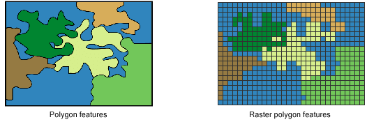

```{r}
#| echo: false
library(tidyverse)
library(here)
library(paindrawr)
```

## Two fundamentally different image formats

#### .. the reason that other guys poster graphics suck!


{width=25% fig-align="center"}

**Raster** vs **Vector**

* Raster: Selfies on your phone
* Vector: Fonts on your computer

## Raster  and Vector images



**Raster** vs **Vector**

* Raster: Spray painting hand pain
* Vector: Polygon around Præstø

## A single pain drawing

### from the pdr_data list-column

```{r}
pdr_example_data[1,]$pdr_data 
```

## Looking at a plot of the same data

```{r}
pdr_example_data[1,] |> pdr_plot_drawing()
```

## Re-introduced the canvas

```{r}
pdr_example_data[1,] |> 
  pdr_plot_drawing(background_image = pdr_example_file("mird_body_background.png"))
```

## A detour..

Another data set:

```{r}
pdr_example_anatomy
```

## Filtering and imploding drawings

```{r}
#| echo: true

pdr_example_anatomy |>
  filter(str_detect(id, "(Mid_back_bottom)|(Back.+(lowerback|buttock))")) |>
  pdr_implode() |> 
  mutate(pdr_data = pdr_polygonize(pdr_data)) |>
  pdr_plot_polygons(paindrawr_data = pdr_data, background_image = pdr_example_file("mird_body_background.png"))
  
```


## Merging by union

### ...we store this polygon as 'lb_poly'

```{r}
#| echo: true

lb_poly <- pdr_example_anatomy |>
  filter(str_detect(id, "(Mid_back_bottom)|(Back.+(lowerback|buttock))")) |>
  pdr_implode() |> 
  mutate(pdr_data = pdr_polygonize(pdr_data)) |>
  mutate(pdr_data = pdr_modify_polygons(pdr_data, "merge_overlaps")) |>
  mutate(lb_template = pdr_get_info(pdr_data, ".polygons"))
lb_poly |> pdr_plot_polygons(paindrawr_data = pdr_data, background_image = pdr_example_file("mird_body_background.png"))
  
```

## Bring it all together

### ..the raw pain drawwing

```{r}
pdr_example_data[1,] |> 
  pdr_plot_drawing(background_image = pdr_example_file("mird_body_background.png"))
```

## Bringing it all together

### ..the polygonized and merged pain drawing

```{r}
pdr1 <- pdr_example_data[1,] |>
  mutate(pdr_data = pdr_polygonize(pdr_data, buffer=10)) |> 
  mutate(pdr_data = pdr_modify_polygons(pdr_data, "merge_overlaps")) |>
  mutate(lb_template = lb_poly$lb_template) 
pdr1 |>  pdr_plot_polygons(pdr_data, background_image = pdr_example_file("mird_body_background.png"))

area_pdr1 <- pdr1 |>
  mutate(area = pdr_poly_areas(pdr_data)) |> pull(area)
```

..which has an area of `r round(area_pdr1)`

## Bring it all together

### ..reduced to 'low back' intersection

```{r}
pdr2 <- pdr_example_data[1,] |>
  mutate(pdr_data = pdr_polygonize(pdr_data, buffer=10)) |> 
  mutate(pdr_data = pdr_modify_polygons(pdr_data, "merge_overlaps")) |>
  mutate(lb_template = lb_poly$lb_template) |>
  mutate(pdr_data2 = pdr_modify_polygons(pdr_data, ops="reduce_by_template", template=lb_template)) 

pdr2 |> pdr_plot_polygons(pdr_data2, background_image = pdr_example_file("mird_body_background.png"))

area_pdr2 <- pdr2 |>
  mutate(area = pdr_poly_areas(pdr_data2)) |> pull(area)
```

..which has an area of `r round(area_pdr2)`

## All together now

```{r}
pdr_example_data |>
  mutate(pdr_data = pdr_polygonize(pdr_data, buffer=10)) |> 
  mutate(pdr_data = pdr_modify_polygons(pdr_data, "merge_overlaps")) |>
  mutate(lb_template = lb_poly$lb_template) |>
  mutate(pdr_data2 = pdr_modify_polygons(pdr_data, ops="reduce_by_template", template=lb_template)) |>
  mutate(total_area = pdr_poly_areas(pdr_data)) |>
  mutate(lbp_area = pdr_poly_areas(pdr_data2)) |> 
  dplyr::select(id, total_area, lbp_area)
```

## Back to Zealand, Præstø and Holbæk

```{r}
tmp_template <- readRDS(here("data/pdr_example_zealand.rds"))

tmp_template <- tmp_template |>
  mutate(pdr_data = pdr_modify(pdr_data, ops="flipy")) |>
  pdr_implode() |> 
  mutate(pdr_data = pdr_polygonize(pdr_data)) |>
  mutate(lb_template = pdr_get_info(pdr_data, ".polygons"))
tmp_template |> pdr_plot_polygons(paindrawr_data = pdr_data, background_image = pdr_example_file("zealand.png"))
```

## User input
```{r}
tmp_data <- readRDS(here("data/temporary_my_data_for_presentation_towns_in_zealand.rds")) |> select(id=record_id, pdr_data=draw_zealand)
tmp_data <- tmp_data |> 
  pdr_implode(pdr_data) |>
  mutate(pdr_data = pdr_polygonize(pdr_data, 10)) 

tmp_data |> pdr_plot_polygons(pdr_data, background_image = pdr_example_file("zealand.png")) 
```

## Areas inside template
```{r}
tmp_data$templates_ph <- tmp_template$lb_template

tmp_data |>
  mutate(total_area = pdr_poly_areas(pdr_data)) |>
  mutate(pdr_data = pdr_modify_polygons(pdr_data, ops="reduce_by_template", template=templates_ph)) |>
  mutate(correct_area = pdr_poly_areas(pdr_data)) |> 
  select(id, total_area, correct_area)
```

